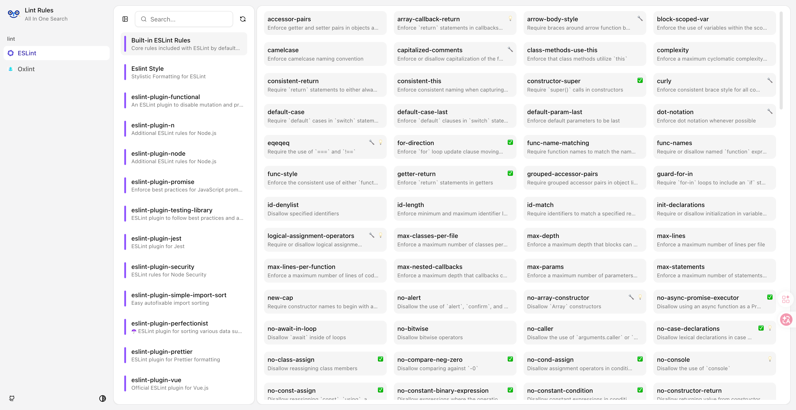

# Lint Rules

> All-in-one lint rules hub: ESLint + plugins, Stylelint, Biome, and other linters — searchable & categorized.

  

## 👉 [Check it out](https://lint-rules.vercel.app/)

## ✨ Features

- 🔍 **Powerful Search** - Quickly find the lint rules you need
- 📚 **Detailed Documentation** - Each rule can quickly navigate to its official detailed explanation and examples
- 🎨 **Modern UI** - Clean and beautiful user interface

## 🛠️ Supported Linter Tools

| Linter | Description | Rules Count | Status |
|--------|-------------|-------------|--------|
| **ESLint** | Pluggable JavaScript and TypeScript linter | 1000+ rules | ✅ |
| **Oxlint** | High-performance JavaScript/TypeScript linter by Oxidation | 800+ rules | ✅ |
| **Biome** | Fast formatter and lint tool | - | 🔜 |

> 💡 **Note**: The number of rules may change with linter version updates. Please check the official website for details.

## 🎯 Vision

**Lint Rules** aims to be an encyclopedia of lint rules for developers, making it easy for everyone to understand and use various lint tools.

### What We Believe

- **📚 Knowledge Should Be Accessible** - Lint rules shouldn't be hidden deep in documentation, they should be at your fingertips
- **🚀 Improve Code Quality** - By understanding lint rules, write higher quality code with fewer bugs
- **🌍 Lower the Learning Curve** - Provide clear rule explanations for both beginners and experienced developers
- **🤝 Community Driven** - Open source project, welcome community contributions and feedback

## 📄 License

[MIT](./LICENSE) License
